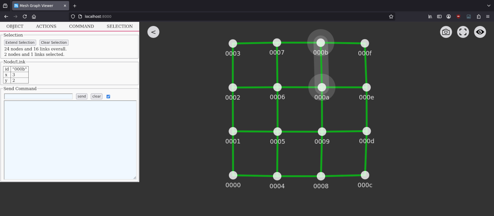

# Mesh Graph Viewer

View mesh networks described in a JSON file. This tool is meant to visualize mesh network simulations for research. Interactions with the graph (selection, deletion, etc.) and custom commands can be passed to external programs. The view is updated as soon as the JSON file is changed.

Written in an unholy combination of C and JavaScript. Build with [d3js](https://d3js.org/), [leafletjs](https://leafletjs.com/) and [libmicrohttpd](https://www.gnu.org/software/libmicrohttpd/).




## Usage

Usage: `graph-viewer [<arguments>] <graph-file>`

Arguments:

* `--graph` *graph-file*  
  Graph topology and data in JSON format. May be first unnamed argument.  
  The graph file is reloaded when its timestamp changes.
* `--call` *path|address*  
  Commands triggered via the web interface are used as programm arguments,  
  or send to a unix socket file or given IP address via TCP/UDP.  
  E.g. `/usr/bin/send_program`, `unix:///var/com.sock`, `tcp://localhost:3000`.
* `--config` *json-file*  
  Configuration file for custom command buttons, colors and map tile sources.
* `--open`  
  Open browser and show graph.
* `--webserver-address` *address*  
  Address for the build-in webserver. Default: 127.0.0.1:8000
* `--webserver-path` *path*  
  Root folder for the build-in webserver. For development. Default: internal
* `--write-out-files` *path*  
  Write included html/js/css files to disk. For development.
* `--version`  
  Print version.
* `--help`  
  Display help.

## Graph JSON format

Minimal graph example:
```
{
  "links": [{"source": "a", "target": "b"}]
}
```

More elaborate example:
```
{
  "nodes": [
    {
      "id": "a"
    },
    {
      "id": "b",
      "x": 52.5162,
      "y": 13.3777,
      "label": "Label",
      "name": "Name",
      "radius": 12,
      "color": "#DAA520",
      "clients": 5
    }
  ],
  "links": [
    {
      "source": "a",
      "target": "b",
      "target_tq": 1,
      "source_tq": 1,
      "color": "#7CFC00",
      "label": "Link A/B"
    }
  ]
}
```

Note:

* `id`/`source`/`target`: Node identifier. These are mandatory options.
  * An alternative for `id` is `node_id`.
* `target_tq`/`source_tq`: link quality in the range of `[0..1]`.
* `label`: Display a label on top of a node or link.
* `name`: Display a name under a node. Defaults to `id` if not disabled.
* `x`/`y`: Geographical position, also used for initial position in topological view.
  * An alternative for `x`/`y` is `location: { longitude: 52.5162, latitude: 13.3777}`.
* `clients`: Display a number of small circles around each node.
* `color`: Color of a node or link. CSS color format. By default the link color is based on `target_tq` and `source_tq`.
* `radius`: Radius of the node circle.

## Build

Install:

- C compiler (e.g. clang or gcc)
- xxd tool to include html/js/css data into binary (package `xxd` or as part of `vim-common`)
- libmicrohttpd and the development headers

Build:

```
make
```

This should create a single standalone program called `graph-viewer`.

## Custom Buttons

Add new buttons using the configuration file [config.json](config.json) and pass it to grap-viewer via the `--config` argument. Other available options like colors etc. can be gathered from the internal index.html default config object.

## Command line variables

In the command line, the variables `%selected_nodes%` and `%selected_links%` will be expanded to a comma separated list.

## Related Software

* [WebView D3](https://github.com/byt3bl33d3r/webview_d3)
* [MeshViewer](https://github.com/ffrgb/meshviewer)
* [HopGlass](https://github.com/hopglass/hopglass)
* [NetJSON NetworkGraph](https://github.com/openwisp/netjsongraph.js)
* [graph-tool](https://graph-tool.skewed.de/)
* [NetworkX](https://networkx.github.io/)
* [Gephi](https://gephi.org/)
* [vis.js](http://visjs.org/)
* [igraph](https://igraph.org/redirect.html)

## Authors

The base of the JavaScript/CSS code was taken from the [MeshViewer](https://github.com/ffrgb/meshviewer) project.

## License

AGPL-3.0-or-later
